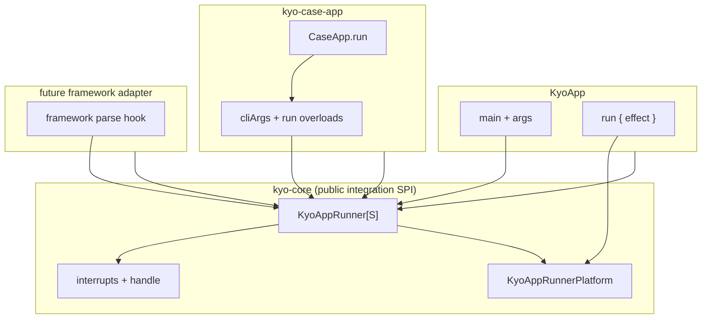

# ADR 0001: Shared application runner for CLI and framework entrypoints

| Field | Value |
|-------|--------|
| **Status** | Accepted (implemented in PR [#1619](https://github.com/getkyo/kyo/pull/1619)) |
| **Date** | 2026-05-18 |
| **Context** | [kyo-case-app](https://github.com/getkyo/kyo/pull/1619), review by [@hearnadam](https://github.com/hearnadam) |
| **Deciders** | Kyo maintainers (pending) |

## Context and problem statement

Kyo provides [`KyoApp`](../../../kyo-core/shared/src/main/scala/kyo/KyoApp.scala) for effectful program entrypoints using raw `args`. This module ([`kyo-case-app`](../../README.md)) bridges [case-app](https://github.com/alexarchambault/case-app) parsing to the same runtime model (`initCode`, `KyoApp.runAndBlock`, interrupt handling, `onResult`).

Today that bridge **reimplements** logic that already exists on `KyoApp`:

| Concern | `KyoApp` | `kyo-case-app` (initial) |
|---------|----------|---------------------------|
| SIGINT / SIGTERM + `Scope.run` race | `KyoApp` class | `KyoCaseAppInterrupts` (copy) |
| `onResult` (print, rethrow, exit code) | `KyoApp.Base` | `KyoCaseAppSupport` (copy, `exitApp`) |
| JVM: register thunk + `runAndBlock` | `KyoAppPlatformSpecific` | `KyoCaseAppPlatformSpecific` (copy) |
| JS: fiber chain + timeout race | `KyoAppPlatformSpecific` | `KyoCaseAppPlatformSpecific` (copy) |

Roughly **55–80 lines** of parallel logic exist across modules. Any fix to interrupts, result handling, or JS startup must be applied twice.

Review feedback asks to merge this with `KyoApp`, optionally via extension or `private[kyo]` hooks.

Separately, we expect **more entrypoint integrations** (other CLI libraries, test harnesses, build-tool runners, etc.). We need a strategy that:

1. Removes duplication for `kyo-case-app` now.
2. Does **not** force every future integration to be a new published `kyo-*` module that copy-pastes the same runner.
3. Preserves clear user-facing APIs (`KyoApp`, `KyoCaseApp`, …) without leaking unstable internals.

## Decision drivers

- **Single source of truth** for interrupts, effect execution, and `Result` handling at the process boundary.
- **MiMa / API stability**: avoid accidental public surface growth.
- **Cross-platform parity** (JVM, JS, Native) without N× copies per integration.
- **Future integrations** should depend on **`kyo-core` (or a small apps API)** rather than forking runner code.
- **case-app specifics** (parse hook, `RemainingArgs`, `exit` name clash) stay outside the shared runner.
- **Incremental delivery** (mergeable phases).

## Considered alternatives

### Alternative 1 — Status quo (duplicate per module)

Keep `KyoCaseAppInterrupts`, duplicated `onResult`, and per-module platform traits.

| Pros | Cons |
|------|------|
| No `kyo-core` refactor | Violates review intent; ongoing drift |
| Smallest short-term diff | Each new `kyo-*` integration repeats ~70 lines |

**Verdict:** Reject.

---

### Alternative 2 — `private[kyo]` extraction only (monorepo package coupling)

Move shared code into `kyo-core` as `private[kyo]` traits (`KyoAppInterrupts`, `KyoAppRunner`, `KyoAppRunnerPlatform`). Only code in **`package kyo`** (including `kyo-case-app`, which uses `package kyo`) can mix them in.

```scala
// kyo-core — not part of public Scaladoc contract
private[kyo] trait KyoAppRunner[S]:
  protected var initCode: Chunk[() => Unit]
  protected def exitHook(code: Int)(using AllowUnsafe): Unit
  final protected def onResult[...](...): Unit = ...
  private[kyo] final def registerJvmEffect(...): Unit = ...
```

```scala
// kyo-case-app — thin
abstract class KyoCaseApp[T](...) extends CaseApp[T](...)
    with KyoCaseAppSupport[T, S]
    with KyoAppRunner[S]
    with KyoAppRunnerPlatform   // from kyo-core jvm-native / js
```

| Pros | Cons |
|------|------|
| Maximum dedup **inside the monorepo** | **External integrators cannot use it** unless they also use `package kyo` (undesirable) |
| No public MiMa surface | Every third-party adapter still needs a custom module or copy-paste |
| Can delete all case-app platform files | Hides the “integration SPI” from documented API |

**Verdict:** Good **implementation tactic**, insufficient as the **whole strategy** if we want third-party framework adapters without new `kyo-*` artifacts.

---

### Alternative 3 — Public `KyoAppRunner` integration API in `kyo-core` (recommended)

Introduce a **documented, stable integration layer** in `kyo-core` (name: **`KyoAppRunner`**). `KyoApp` refactors to use it; `kyo-case-app` depends on it; future frameworks depend on **`kyo-core` only**.

#### Shape

```
kyo-core/
  shared/
    KyoAppRunner.scala           # integration SPI (public)
    KyoAppInterrupts.scala       # may be nested or mixed into runner
  jvm-native/
    KyoAppRunnerPlatform.scala   # JVM registration (public or apps package)
  js/
    KyoAppRunnerPlatform.scala   # JS registration
```

**`KyoAppRunner[S]`** (public responsibilities):

| API | Purpose |
|-----|---------|
| `initCode` / `runInitCode()` | Ordered registration queue |
| `runTimeout` | Per-block timeout |
| `exitHook(code)` | Process exit (`exit` vs `exitApp`) |
| `onResult(result)` | Unified `Result` handling (final) |
| `handle(effect)` | Interrupt-aware `Scope.run` |
| `registerEffect(...)` | Platform calls this (JVM: `runAndBlock`; JS: fiber loop) |

**Entry-specific modules stay thin:**

| Module | Owns |
|--------|------|
| `kyo-case-app` | `CaseApp.run`, `cliArgs`, `run { options => ... }` overloads, `exitApp` → `exitHook` |
| Future `acme-cli` adapter | That library’s parse hook → `registerEffect` |
| `KyoApp` | `main(args)`, `args`, `run { ... }` sugar |

#### Example: future third-party integration (no new Kyo module required)

A library maintainer or userland adapter can ship a **small jar** or in-repo trait:

```scala
package com.example.mycli

import kyo.*
import kyo.KyoAppRunner

trait MyCliEntry[T] extends MyCliFramework[T]
    with KyoAppRunner[Async & Scope & Abort[Throwable]]
    with KyoAppRunnerPlatform:

  final def afterParse(options: T): Unit =
    registerEffect(runUserLogic(options))   // hypothetical API

  protected def exitHook(code: Int)(using AllowUnsafe) =
    java.lang.System.exit(code)
```

They add **`kyo-core` only** — not a fork of interrupt/`onResult`/JS fiber code.

| Pros | Cons |
|------|------|
| Addresses review + **future frameworks** | Public API must be designed and MiMa-checked |
| `kyo-case-app` becomes ~50 lines of real case-app logic | One-time refactor of `KyoApp` |
| Clear story: “how to build a Kyo entrypoint” | Slightly larger documented surface |
| Third-party integrations avoid `kyo-case-app`-style modules | Need versioning discipline for SPI |

**Verdict:** **Recommended** as the strategic direction.

---

### Alternative 4 — `KyoAppRunner` public SPI + `private[kyo]` implementation details (hybrid)

Same as Alternative 3, but:

- **Public:** `KyoAppRunner`, `KyoAppRunnerPlatform`, `onResult`, `registerEffect` contracts.
- **`private[kyo]`:** signal registration helpers, empty-run `Ansi` builders, JS `deferredRuns` internals if we want to tweak without MiMa.

| Pros | Cons |
|------|------|
| Best of both: documented SPI + freedom to refactor internals | Two visibility levels to explain |
| Monorepo modules can share extra `private[kyo]` helpers | — |

**Verdict:** Recommended **implementation** of Alternative 3.

---

### Alternative 5 — Extend `KyoApp.Base` from case-app

`KyoCaseAppSupport extends KyoApp.Base[S]` alongside `CaseApp[T]`.

| Pros | Cons |
|------|------|
| Reuses `Base` literally | **`run` name clash**: `CaseApp.run(options, rem)` vs `run { effect }` |
| | `main(args)` vs case-app `main` — two entry models |
| | Tangles case-app with `KyoApp` inheritance hierarchy |

**Verdict:** Reject.

---

### Alternative 6 — Composition: embed a `KyoApp` instance

Delegate to an anonymous `KyoApp` for execution.

| Pros | Cons |
|------|------|
| No new types | Awkward lifecycle; `run` registration timing; two objects per app |
| | Hard to wire `CaseApp.run` to the right instance |

**Verdict:** Reject.

---

### Alternative 7 — Extension methods on `KyoApp` companion only

```scala
extension (app: KyoApp.type) def registerParsedRun(...): Unit
```

| Pros | Cons |
|------|------|
| Minimal surface | Does not model `initCode` queue shared with non-`KyoApp` entrypoints |
| | Poor fit for `KyoCommand` / other entry types |

**Verdict:** Reject as primary design; optional sugar only.

---

### Alternative 8 — Free functions in `kyo.internal`

`kyo.internal.runAppEffect(...)` with all logic.

| Pros | Cons |
|------|------|
| Centralized | **`kyo.internal` is not for integrations**; same monorepo-only issue as Alt 2 |
| | No mixin for `initCode` / per-app state |

**Verdict:** Reject for integrations; keep `internal` for runtime primitives.

---

## Comparison matrix

| Criterion | Alt 1 Status quo | Alt 2 `private[kyo]` only | Alt 3 Public `KyoAppRunner` | Alt 4 Hybrid |
|-----------|------------------|---------------------------|-----------------------------|--------------|
| Dedup for case-app | ✗ | ✓✓ | ✓✓ | ✓✓ |
| Dedup JVM/JS platforms | ✗ | ✓✓ | ✓✓ | ✓✓ |
| Third-party without new `kyo-*` module | ✗ | ✗ | **✓** | **✓** |
| MiMa discipline | ✓ | ✓✓ | Requires design | ✓ |
| Refactor size | None | Medium | Medium–large | Medium–large |
| Matches review | ✗ | Partial | **✓** | **✓** |

## Recommendation

Adopt **Alternative 4 (hybrid)**:

1. **`KyoAppRunner[S]`** — public integration SPI in `kyo-core` (documented in Scaladoc as the supported way to build app entrypoints).
2. **`KyoAppRunnerPlatform`** — public JVM / JS mixins (or nested in a `kyo.apps` / `kyo.runner` package if we want to separate from `kyo.*` effect types).
3. **`private[kyo]`** — only for helpers that are not part of the integration contract (e.g. shared `Ansi` empty-run snippet, signal setup details).
4. **Refactor `KyoApp`** to mix `KyoAppRunner` instead of owning duplicate logic.
5. **Slim `kyo-case-app`** to case-app parsing + `run` overloads; **delete** `KyoCaseAppInterrupts` and **`KyoCaseAppPlatformSpecific`** (both platforms).
6. **Phase delivery** (see below).

### Why public `KyoAppRunner` beats `private[kyo]` alone

| `private[kyo]` only | Public `KyoAppRunner` |
|---------------------|------------------------|
| Works because `kyo-case-app` lives in `package kyo` | Works for **any** dependency on `kyo-core` |
| Next integration → new `kyo-foo` module or copy-paste | Next integration → **thin adapter** in user or vendor code |
| SPI is implicit and undocumented | SPI is **versioned and documented** |
| Good for monorepo hygiene | Good for **ecosystem** hygiene |

`private[kyo]` remains valuable **under** `KyoAppRunner` to keep the committed SPI small while refactoring internals between minors.

### Naming

- **`KyoAppRunner`** (preferred): reads as “runner for Kyo apps,” aligns with `KyoApp`.
- Avoid bare `KyoRunner` in public API: too generic and may collide with scheduler / execution “runner” concepts elsewhere in Kyo.

### Target architecture (after refactor)



### Code reuse outcome (approximate)

| Location | Before | After |
|----------|--------|-------|
| `KyoCaseAppInterrupts.scala` | 28 lines | **deleted** |
| `KyoCaseAppPlatformSpecific` (JVM+JS) | ~52 lines | **deleted** |
| `KyoCaseAppSupport.onResult` / `handle` | ~15 lines dup | **`exitHook` only** |
| `KyoApp` interrupt body | ~19 lines | **mixin** |
| `KyoAppPlatformSpecific` (JVM+JS) | ~33 lines | **replaced by `KyoAppRunnerPlatform`** |
| `kyo-core` new runner | 0 | **~80–100 lines** (one copy) |

Net: modest line increase in `kyo-core`, **large reduction** in per-integration duplication; **zero** duplicate platform files per module.

## Implementation phases

| Phase | Scope | Closes review? |
|-------|--------|----------------|
| **1** | `KyoAppInterrupts` + `KyoAppRunner.onResult` / `exitHook` / `runInitCode`; refactor `KyoApp`; case-app drops `KyoCaseAppInterrupts` + duplicate `onResult` | Partial |
| **2** | `KyoAppRunnerPlatform` JVM; delete both JVM platform duplicates | Partial |
| **3** | `KyoAppRunnerPlatform` JS; delete both JS platform duplicates | **Yes** |
| **4** (optional) | Scaladoc “Writing a Kyo entrypoint” page; MiMa filters for SPI package | Ecosystem |

Phases 1–2 can ship in the `kyo-case-app` PR or immediately after; phase 3 if JS diff is large.

## Consequences

### Positive

- Single place to fix interrupts, `onResult`, and platform execution.
- `kyo-case-app` focuses on case-app API design (explicit `run` overloads).
- Future CLI / framework bridges can ship as **thin libraries** depending on `kyo-core`.
- Review thread on duplication can be closed with a clear long-term home.

### Negative / risks

- **MiMa:** `KyoAppRunner` public methods are binary API — need careful initial design.
- **`KyoApp` refactor:** must preserve behavior; rely on `KyoAppTest` + `KyoCaseAppTest`.
- **SPI evolution:** breaking `KyoAppRunner` hurts third-party adapters — use `@since` docs and conservative defaults.

### Neutral

- `kyo-case-app` remains a separate artifact for case-app types and docs; it is not replaced by `KyoAppRunner`, only slimmed.

## Open questions (for maintainers)

1. **Package placement:** `kyo.KyoAppRunner` vs `kyo.apps.KyoAppRunner` vs `kyo.runner.KyoAppRunner`?
2. **MiMa:** full MiMa on runner SPI, or `kyo-core` internal package excluded?
3. **PR scope:** phases 1–2 in [#1619](https://github.com/getkyo/kyo/pull/1619) vs follow-up PR?
4. Should `KyoApp.apply` / `Unsafe.runAndBlock` delegate to `KyoAppRunner` helpers for consistency?

## References

- PR [#1619 — kyo-case-app](https://github.com/getkyo/kyo/pull/1619)
- Issue [#1620](https://github.com/getkyo/kyo/issues/1620)
- Review comment: interrupt / execution / `onResult` deduplication with `KyoApp`
- [`KyoApp.scala`](../../../kyo-core/shared/src/main/scala/kyo/KyoApp.scala)
- [`KyoCaseAppSupport.scala`](../../shared/src/main/scala/kyo/KyoCaseAppSupport.scala)

## Changelog

| Date | Change |
|------|--------|
| 2026-05-18 | Initial proposal (Proposed) |
