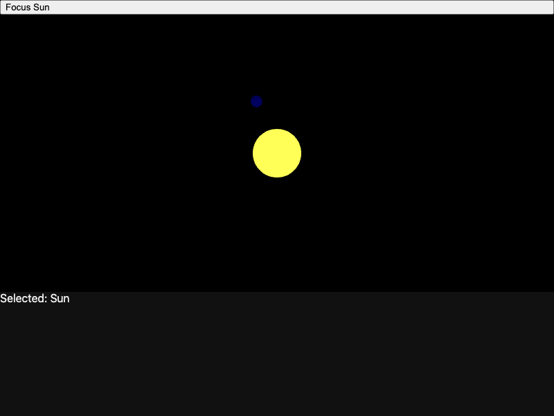
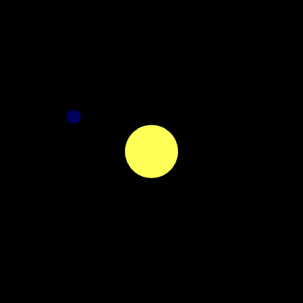
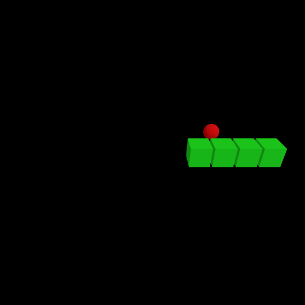
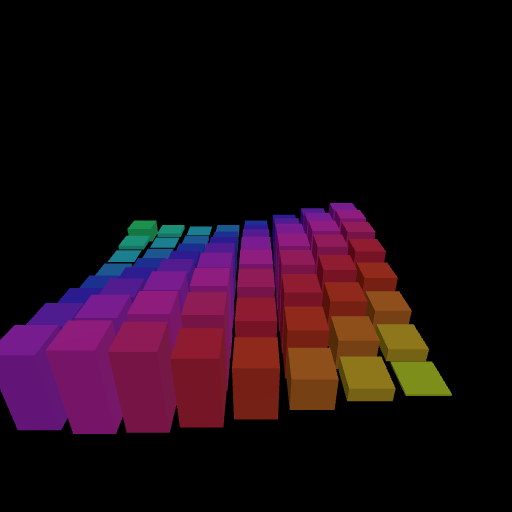
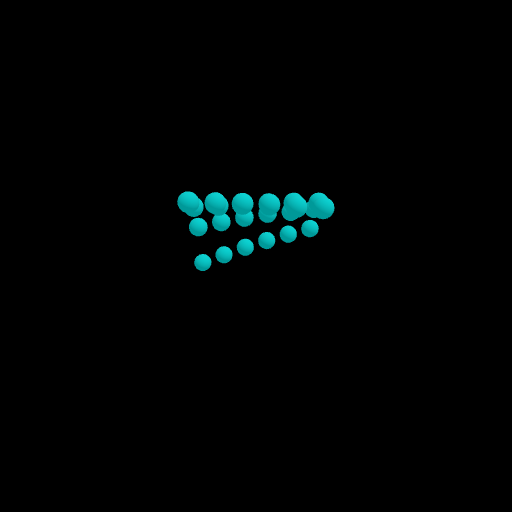
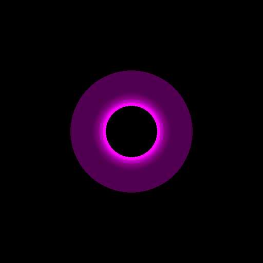

# kyo-threejs

kyo-threejs describes three.js scenes as pure immutable values: a scene-graph tree you build with factory calls, hold, compare, and test, then hand to a runner that turns it into live WebGL. Signals are first-class throughout, so reactivity is a property of the value rather than a layer bolted on top of it. The module targets JavaScript and WebAssembly only, since three.js is a browser/WebGL library.

**A `Three` is a pure value that describes a scene, not a handle to a live one.** You build it with factory calls on the `Three` companion (`Three.scene`, `Three.mesh`, `Three.Geometry.box`, `Three.Material.standard`, `Three.Light.ambient`, `Three.Camera.perspective`). Each call allocates a plain immutable case class and runs no effect, so the result is a `val`: shareable, comparable with `==`, re-renderable, and Node-testable with no GPU and no browser. A geometry pairs with a material to form a mesh, meshes and lights sit inside groups and a scene, and a camera frames it. Nothing touches three.js until you pass the value to a runner.

**The runner is the second beat, never the value itself.** `Three.runMount(scene, camera, selector)` resolves a `<canvas>`, acquires a `WebGLRenderer`, materializes the value, and runs the frame loop. `Three.toImage(scene, camera)` renders one frame headless to a PNG. Both are effect-typed (`< (Async & Scope & Abort[ThreeException])`): the live objects and the renderer are acquired under `Scope`, so teardown disposes every GPU resource, and every failure (a missing canvas, no WebGL context, a failed load) surfaces as a typed `ThreeException` through `Abort`, never a thrown exception.

**Reactivity threads a `Signal` through the same value tree, at two grains.** Every bindable prop (a transform, a color, an opacity, a light intensity, a camera target) has a raw-value factory param and a `Signal`-based setter overload. Passing a `Signal[A]` to a setter drives a targeted mutation of exactly the one live object it binds on each emission, never a scene rebuild. For structure that changes shape rather than a single prop, reactive regions splice a subtree from a signal: `signal.render(f)` swaps one subtree, `signal.foreach`/`foreachKeyed` map a `Signal[Chunk[A]]` to one child per element.

**Interaction and animation are typed `Any < Async` closures.** A per-frame hook is `.onFrame(tick => ...)` on any `Animated` node; pointer interaction is `.onClick`/`.onPointerOver`/`.onPointerOut` on any `Interactive` node. Each handler can suspend, perform `Sync`, raise via `Abort`, sleep, call kyo-http, anything in the kyo ecosystem. The element tree under `Three.Ast.*` is plain case classes; pattern-match on it for tests and transforms.

```scala
import kyo.*

// A pure value: a blue sphere, lit, framed by a camera. No browser, no GPU, nothing runs yet.
val planet =
    Three.mesh(Three.Geometry.sphere(1.0), Three.Material.standard(color = Color.blue))

val scene =
    Three.scene(Three.Light.ambient(intensity = 0.4), Three.Light.point(), planet)

val camera =
    Three.Camera.perspective(position = Vec3(0, 2, 6), lookAt = Vec3.zero)
```

This README threads one running scene: a lit planet that grows a reactive color, a per-frame spin, a keyed belt of moons, then mounts to a canvas and is captured to a PNG.

## Scenes are values

Every scene starts from one of four container or renderable factories on `Three`, each returning a typed node value you hold as a `val`. `Three.scene(children*)` is the render root, one `Scene` per mount. `Three.group(children*)` is a transformable container with no geometry of its own: its transform moves every child as a unit, and it is `Animated` so it can carry an `onFrame` hook. `Three.mesh(geometry, material)` is the renderable, the pairing of a shape with a surface. `Three.empty` is the neutral render-nothing node, used as the false branch of a conditional.

```scala
import kyo.*

val ball = Three.mesh(Three.Geometry.sphere(1.0), Three.Material.standard())

val world =
    Three.scene(
        Three.Light.ambient(),
        Three.group(ball)
    )
```

> **Note:** `Three.mesh` requires both a geometry and a material; a mesh cannot be half-built. There is no default-material shortcut, so a renderable always names its surface explicitly.

> **Unlike** `Three.mesh`, `Three.empty` carries no geometry: it is an empty `Group`, the render-nothing branch you reach for as a conditional placeholder, not a null.

The value is plain data, so `==` compares two scenes structurally (equality is derived across every value type and node), which makes a scene assertion-comparable in a test. The whole tree under `Three.Ast.*` is case classes; you can pattern-match on it directly when a test or a transform needs to inspect structure rather than build it.

## Building a mesh: geometry, material, light, camera

A visible object is the composition of four factory families that share the same pure shape: a shape (`Geometry`), a surface (`Material`), at least one light so a shaded material shows, and a camera that frames the result. Each family is a flat list of `Three.X.factory(...)` calls with sensible defaults, so `Three.Geometry.box()` is a unit cube and `Three.Material.standard()` is a white PBR surface.

### Geometry

`Three.Geometry.{box, sphere, plane, cylinder, cone, torus}` cover the primitive shapes; every parameter is a plain `Double`/`Int` with a default.

```scala
import kyo.*

val box    = Three.Geometry.box() // a unit cube
val ball   = Three.Geometry.sphere(0.4)
val ring   = Three.Geometry.torus(radius = 1.0, tube = 0.4)
val ground = Three.Geometry.plane(10.0, 10.0)
```

### Material

`Three.Material.standard` is the PBR surface (color, metalness, roughness, opacity, emissive, and an optional texture `map`); `Three.Material.basic` is unlit; `Three.Material.line` and `Three.Material.points` surface those primitives. Every color and fraction accepts a raw value by default. To make a prop reactive, call its setter with a `Signal[A]`.

When you want a surface that reacts to lighting (the default for solid objects), use `Three.Material.standard`. When you want a flat fill that ignores lights (a label, a wireframe, an unshaded marker), use `Three.Material.basic`.

```scala
import kyo.*

val metal =
    Three.Material.standard(
        color = Color.gray,
        metalness = Normal(0.9),
        roughness = Normal(0.2)
    )

val flat = Three.Material.basic(color = Color.red)
```

The `map` parameter takes a `Maybe[Texture]`, and the only way to get a `Texture` is the `Three.texture(url)` loader, so adding a texture turns an otherwise-pure scene build into an effect-typed one. That seam is covered in [Loading assets](#loading-assets-gltf-and-textures).

### Light

`Three.Light.{ambient, directional, point, spot, hemisphere}` are the light factories. A `standard` material shows nothing without a light, so a scene that uses shaded surfaces needs at least one. Light intensity is a `Double` factory param and can be made reactive via `.intensity(signal)`.

```scala
import kyo.*

val lights =
    Three.scene(
        Three.Light.ambient(intensity = 0.3),
        Three.Light.directional(intensity = 1.2, position = Vec3(5, 10, 5)),
        Three.Light.point(position = Vec3.zero)
    )
```

### Camera

`Three.Camera.perspective` and `Three.Camera.orthographic` frame the scene. `fov` is a `Radians`, not a raw `Double`, so a field of view cannot be confused with a number. `position` and `lookAt` are plain `Vec3` factory params; to make them reactive call `.position(signal)` or `.lookAt(signal)` on the camera value.

```scala
import kyo.*

val view =
    Three.Camera.perspective(
        fov = Radians.deg(60),
        position = Vec3(0, 7, 7),
        lookAt = Vec3.zero
    )
```

## Value types: Color, Vec3, Radians, Normal

The factories above are typed at their boundaries by four small value types that make an illegal value unrepresentable and construction total. These are fully pure and browser-free, the part of the surface you can exercise with no runner at all.

### Color

`Color` is an opaque packed `0xRRGGBB` integer. Construction is total: `Color.hex` returns `Maybe[Color]` (it never throws on a malformed string), while `Color.rgb` clamps each channel and `Color.hsl` wraps the hue. Named constants cover the common cases, and channel extensions read a color back apart.

```scala
import kyo.*

val sky: Maybe[Color] = Color.hex("#87ceeb") // Present(...) on a valid hex
val bad: Maybe[Color] = Color.hex("nope")    // Absent: malformed input, no throw

val fixed: Color              = Color.hex("#87ceeb").getOrElse(Color.blue)
val warm: Color               = Color.rgb(255, 160, 64)
val hue: Color                = Color.hsl(210, 0.7, 0.5)
val channels: (Int, Int, Int) = (fixed.r, fixed.g, fixed.b)
```

> **Note:** `Color.hex` returns `Maybe[Color]`, so a malformed string is an `Absent` you handle, not an exception. Pair the happy path with a fallback (`getOrElse`) or a branch on the `Maybe`, the same way you would decode any untrusted input.

### Vec3

`Vec3` is the universal spatial value used by positions, scales, light and camera placement, and geometry parameters. The component-wise `+`, `-`, and scalar `*` compose vectors purely, the companion carries the common constants, and `Vec3.ofDegrees` builds a Euler-angle vector (in radians) from degree inputs, the bridge for a `.rotation`.

```scala
import kyo.*

val a: Vec3      = Vec3(0, 2, 6)
val up: Vec3     = Vec3.unitY
val moved: Vec3  = a + up * 3.0
val tilted: Vec3 = Vec3.ofDegrees(0, 45, 0) // 45 degrees of yaw, expressed in radians
```

### Radians and Normal

`Radians` is an opaque `Double` of radians shared by rotations and field of view, so a degree value cannot be passed where radians are meant; build one with `Radians.deg` (converts on construction) or `Radians.rad`, and recover the underlying value with `.toDouble`. `Normal` is an opaque `Double` clamped to `[0, 1]` for the material fractions (opacity, metalness, roughness) and a spot light's penumbra. Light intensity is a plain `Double`, not a `Normal`, so it can exceed `1.0`.

```scala
import kyo.*

val fov: Radians = Radians.deg(75)
val back: Double = fov.toDegrees // 75.0

val opaque: Normal  = Normal(1.0)
val clamped: Normal = Normal(1.7)        // clamps to 1.0
val safe: Normal    = Normal(Double.NaN) // NaN maps to 0.0
```

> **Note:** `Normal(...)` clamps any input into `[0, 1]` and maps `NaN` to `0` on construction, silently. You cannot build a material or light with an out-of-range fraction, so an over-bright value is folded into range rather than rejected.

## Transforms, interaction, and animation

A static node becomes a placed, clickable, animated one through chainable setters on `Object3D`. Every setter returns a new value of the same node type (the node is immutable), so you chain them and bind the result to a `val`.

### Transforms

`.position(v: Vec3)`, `.rotation(v: Vec3)`, and `.scale(v: Vec3)` set static transforms. To make a transform reactive, pass a `Signal[Vec3]` to the same setter: `.position(signal)`, `.rotation(signal)`, `.scale(signal)`. The reconciler patches the live object on each emission, never rebuilding the scene. Rotation components are radian-valued, so reach for `Vec3.ofDegrees` when you think in degrees.

```scala
import kyo.*

val placed =
    Three.mesh(Three.Geometry.box(), Three.Material.standard())
        .position(Vec3(4, 0, 0))
        .rotation(Vec3.ofDegrees(0, 30, 0))
        .scale(Vec3(1, 2, 1))
```

### Interaction

`.onClick`, `.onPointerOver`, and `.onPointerOut` attach raycast pointer handlers on any `Interactive` node (a `Mesh` or a `Custom`). The handler receives a `Pointer` (the world-space hit point, the ray distance, the normalized device coordinates, and the pressed buttons) and returns `Any < Async`. The return value is discarded; reach the rest of your app through a `SignalRef`.

```scala
import kyo.*

val clickable =
    for selected <- Signal.initRef("none")
    yield Three.mesh(Three.Geometry.sphere(1.0), Three.Material.standard())
        .onClick(_ => selected.set("planet"))
        .onPointerOver(p => Console.printLine(s"hover at ${p.point}"))
```

### Animation

`.onFrame` attaches a per-frame hook on any `Animated` node (a `Mesh`, a `Group`, or a `Custom`). The handler receives a `Three.Tick` (`elapsed`, `delta`, `frameIndex`) and returns `Any < Async`. A spin is the canonical case: an `onFrame` advances an angle in a `SignalRef`, and `.rotation(signal)` binds the rotation to that angle.

```scala
import kyo.*

val spinning =
    for angle <- Signal.initRef(0.0)
    yield Three.mesh(Three.Geometry.box(), Three.Material.standard(color = Color.blue))
        .rotation(angle.map(a => Vec3(0, a, 0)))
        .onFrame(t => angle.updateAndGet(_ + t.delta.toMillis * 0.001))
```

> **Note:** a `Group` is `Animated` but not `Interactive`: it carries an `onFrame` hook (a geometry-free per-frame ticker is a common pattern, a `Three.group().onFrame(...)` that advances scene state) but takes no `.onClick`. A `Mesh` and a `Custom` are both. Attach click handlers to meshes; attach frame ticks to either.

## Reactivity: signal props and reactive regions

Reactivity threads a `Signal` through the same value tree, at two grains. The first grain is prop-level: a single bound property follows a signal. The second is structural: a region of the tree changes shape as a signal emits. Both are pure values (the node holds the signal; nothing runs until a runner observes it).

### Signal props: prop-level binding

Every bindable prop has two setter overloads: one accepting a raw value (for static props) and one accepting a `Signal[A]` (for reactive props). Passing a `Signal[A]` drives a targeted mutation of exactly the one live object it binds on each emission, never a scene rebuild. A reactive color on one mesh patches that mesh's material and re-renders nothing else: no virtual scene, no rebuild.

```scala
import kyo.*

val pulsing =
    for phase <- Signal.initRef(0.0)
    yield Three.mesh(
        Three.Geometry.box(0.8, 1.0, 0.8),
        Three.Material.standard().color(phase.map(p => Color.hsl(p * 40 % 360, 0.7, 0.5)))
    ).scale(phase.map(p => Vec3(1, 1 + math.sin(p), 1)))
```

> **Note:** a signal setter patches the one object it binds, never the scene. Hundreds of cubes can each bind their own color and height to a shared phase signal, and a phase change applies one targeted FFI setter per cube, not a scene diff.

### Reactive regions: structural change

When the shape of a subtree changes (a whole branch swaps, or a collection grows and shrinks), splice a region from a signal. The region's extension methods live in `object Three`, so import them by name: `import kyo.Three.{render, foreach, foreachKeyed}`.

`Three.reactive(signal)` and `signal.render(f)` swap one subtree on each emission. `signal.foreach(render)` maps a `Signal[Chunk[A]]` to one child per element. `signal.foreachKeyed(key)(render)` does the same with keyed reconciliation. `Three.when(cond)(body)` shows `body` while the condition holds, else `Three.empty`.

```scala
import kyo.*
import kyo.Three.foreachKeyed

final case class Moon(id: Int, pos: Vec3) derives CanEqual

val belt =
    for moons <- Signal.initRef(Chunk(Moon(0, Vec3(2, 0, 0)), Moon(1, Vec3(-2, 0, 0))))
    yield Three.scene(
        Three.Light.ambient(),
        moons.foreachKeyed(_.id.toString) { m =>
            Three.mesh(Three.Geometry.sphere(0.3), Three.Material.standard()).position(m.pos)
        }
    )
```

When the rendered collection is reordered or has elements inserted, choose `foreachKeyed` and not `foreach`. A keyed region diffs by key, so an unchanged element reuses its existing live node and its GPU buffers survive across the change. A plain `foreach` diffs by position, so a reorder recreates the meshes and re-uploads their buffers. The framework does not infer keys.

> **Caution:** picking `foreach` for a collection that reorders silently recreates every live mesh on each change. In 3D the cost is a GPU buffer re-upload per element, not a cheap node recompute. Reach for `foreachKeyed` with a stable key whenever element identity outlives position.

> **Note:** `Three.when(condition)(body)` takes its `body` by name and re-evaluates it on each transition to `true`, so any side effect in the body re-runs on every show. Keep the body a pure scene description.

## Running a scene: mount and the frame loop

The runners are the first effect-typed surface. `import kyo.*` brings all six runner methods (`runMount`, `testDriver`, `loadGltf`, `texture`, `toImage`, and `embed`, the kyo-ui bridge covered in [Embedding as a child node](#embedding-as-a-child-node)) into scope as members of `object Three`. No extra import is needed: `Three.runMount`, `Three.embed`, and the rest are plain members of the `Three` companion object.

`Three.runMount(scene, camera, selector, frames)` resolves the `<canvas>` at `selector`, acquires a `WebGLRenderer` into it under `Scope`, materializes the scene, forks one observe fiber per reactive prop, wires pointer delegation, and runs the frame loop until the scope closes. The whole effect is `< (Async & Scope & Abort[ThreeException])`: teardown disposes the renderer and every GPU resource, and a missing canvas or absent WebGL context surfaces as a typed `ThreeException` through `Abort`.

```scala
import kyo.*

val mounted =
    // The planet, scene, and camera from the opening, now passed to a runner.
    val planet = Three.mesh(Three.Geometry.sphere(1.0), Three.Material.standard(color = Color.blue))
    val scene  = Three.scene(Three.Light.ambient(intensity = 0.4), Three.Light.point(), planet)
    val camera = Three.Camera.perspective(position = Vec3(0, 2, 6), lookAt = Vec3.zero)
    Three.runMount(scene, camera, "#app")
end mounted
```

The pointer handlers from [Transforms, interaction, and animation](#transforms-interaction-and-animation) fire only under a live mount: `runMount` installs the raycast delegation that dispatches them. On a `pointerdown`, the runner casts a ray from the camera through the pointer, finds the front-most `Interactive` node under it, and runs that node's `onClick` with the `Pointer` payload; `pointermove` tracks the hovered node and fires `onPointerOut` on the one left and `onPointerOver` on the one entered. A scene built and inspected without a mount carries its handlers as data, but nothing dispatches them until it is mounted.

```scala
import kyo.*

val selectable =
    for
        selected <- Signal.initRef("none")
        planet = Three.mesh(Three.Geometry.sphere(1.0), Three.Material.standard(color = Color.blue))
            .onClick(_ => selected.set("planet"))
        scene  = Three.scene(Three.Light.ambient(), Three.Light.point(), planet)
        camera = Three.Camera.perspective(position = Vec3(0, 2, 6), lookAt = Vec3.zero)
        _ <- Three.runMount(scene, camera, "#app")
    yield ()
```

A handler returns `Any < Async`, so it can do anything an effect can: write a `SignalRef` the rest of the scene (or a kyo-ui HUD) observes, log, call a service. The selection above flows back into the scene by binding some prop to `selected`.

### ThreeFrames: the frame source

The `frames` parameter picks where ticks come from. `ThreeFrames.Raf` (the default) drives the loop from the browser `requestAnimationFrame`, a smooth render-rate loop. `ThreeFrames.Clock(interval)` runs a fixed interval via `Clock.repeatAtInterval`, the right source for a fixed-step simulation. `ThreeFrames.Manual(withDriver)` hands a test a `Three.Driver` to step frames by hand.

```scala
import kyo.*

val stepped =
    val scene  = Three.scene(Three.Light.ambient(), Three.mesh(Three.Geometry.box(), Three.Material.standard()))
    val camera = Three.Camera.perspective()
    Three.runMount(scene, camera, "#app", ThreeFrames.Clock(150.millis))
end stepped
```

Pick `ThreeFrames.Clock` for a simulation whose logic depends on a fixed step (a game tick, a physics step), `ThreeFrames.Raf` for a loop that should track the display refresh, and `ThreeFrames.Manual` (or `Three.testDriver` below) for a deterministic test. Each tick advances a `Three.Tick(elapsed, delta, frameIndex)`, runs every `onFrame` closure once, then submits exactly one render.

## Loading assets: glTF and textures

Models and textures are loaded, not constructed, so both are Scope-managed loaders typed `< (Async & Scope & Abort[ThreeException])`: each disposes its GPU resources on scope close, and a network or parse failure surfaces as `ThreeException.AssetLoadFailed`.

`Three.loadGltf(url)` loads a glTF/GLB and returns an `Asset.Gltf`. Its `root` is a `Three.Ast.Custom[js.Dynamic]`, which is both `Interactive` and `Animated`, so you attach `.onClick`/`.onFrame` directly on a loaded model with no cast; its `nodes` map gives named sub-nodes for per-part handlers, and `animations` lists the clip names.

```scala
import kyo.*

val viewer =
    for
        asset <- Three.loadGltf("/models/helmet.glb")
        angle <- Signal.initRef(0.0)
        root = asset.root
            .onPointerOver(_ => Log.info("pointer over model"))
            .onClick(_ => Log.info("clicked model"))
        rig = Three.group(root)
            .rotation(angle.map(a => Vec3(0, a, 0)))
            .onFrame(t => angle.updateAndGet(_ + t.delta.toMillis * 0.0005))
    yield Three.scene(Three.Light.ambient(intensity = 0.4), rig)
```

`Three.texture(url)` loads an image into a GPU texture handle for a material `map`. Because a `Texture` exists only through this loader, applying one is the single place a material factory call participates in an effect row: a `for tex <- Three.texture(url)` block that yields a mesh whose `Material.standard(map = Present(tex))` references it.

```scala
import kyo.*

val textured =
    for tex <- Three.texture("/textures/earth.jpg")
    yield Three.mesh(
        Three.Geometry.sphere(1.0),
        Three.Material.standard(map = Present(tex))
    )
```

> **Note:** adding a texture map turns an otherwise-pure scene build into an effect-typed one. The rest of a scene is a pure `val`; the moment a material references a loaded texture, the build it sits in inherits `< (Async & Scope & Abort[ThreeException])`, and the texture disposes when that scope closes.

## Headless capture: scene to PNG

`Three.toImage(scene, camera, width, height)` renders one frame headless and returns a kyo-browser `Image` you can write to disk or serve, without ever mounting a canvas. It is its own product (server-side thumbnails, visual snapshots) and its own semantics.

```scala
import kyo.*

val capture =
    val scene = Three.scene(
        Three.Light.ambient(),
        Three.mesh(Three.Geometry.torus(), Three.Material.standard(color = Color.magenta))
    )
    val camera = Three.Camera.perspective(position = Vec3(0, 0, 4), lookAt = Vec3.zero)
    for
        img <- Three.toImage(scene, camera, 512, 512)
        _   <- img.writeFileBinary("runs/thumbnail.png")
    yield ()
    end for
end capture
```

Both `runMount` and `toImage` materialize the same `Three` value, but the loop differs. `runMount` runs the live loop: it forks an observe fiber per reactive prop and drives every `onFrame` each tick. `toImage` fills every reactive prop and every structural reactive region once from each signal's current value, then renders a single frame: no loop, no `onFrame`.

When you need an animation playing over time (a spin that integrates ticks, a simulation that accumulates), mount it. When you need one deterministic still of a scene's current state, capture it.

> **Caution:** a scene whose visible state depends on `onFrame` accumulation (a spin that integrates over ticks) captures at its seed value under `toImage`, because `toImage` never runs the frame loop. A prop bound to a signal does show its current value in the capture; what does not appear is anything that only an accumulated frame loop would have produced.

## Testing scenes deterministically

Because a scene is a value, most assertions need no runner at all: build it, pattern-match on `Three.Ast.*`, compare with `==`. When an assertion is about animation, `Three.testDriver(scene, camera)` yields a `Three.Driver` whose `.step(delta)` advances exactly one tick with no sleep, the same driver the `ThreeFrames.Manual` path hands a test.

```scala
import kyo.*

val driven =
    for
        angle <- Signal.initRef(0.0)
        mesh = Three.mesh(Three.Geometry.box(), Three.Material.standard())
            .rotation(angle.map(a => Vec3(0, a, 0)))
            .onFrame(t => angle.updateAndGet(_ + t.delta.toMillis * 0.001))
        scene  = Three.scene(Three.Light.ambient(), mesh)
        camera = Three.Camera.perspective()
        driver <- Three.testDriver(scene, camera) // < (Async & Scope)
        _      <- driver.step(16.millis)          // .step adds Abort[ThreeException]; one tick, no sleep
        a      <- angle.current
        _ = assert(a > 0.0) // one tick advanced the angle past zero
    yield ()
```

`Three.testDriver` and `ThreeFrames.Manual(withDriver)` yield the same driver, so a unit test steps a scene's frame loop by hand and asserts the mutated state after a known number of steps. Combined with `Clock.withTimeControl`, a `ThreeFrames.Clock`-driven loop is deterministic too, so even the live loop can be advanced under test control.

## Escape hatch: raw three.js

Anything not yet in the typed surface (post-processing passes, skeletal animation, geometries or loaders not listed above) is reachable today through a typed builder, never blocked. `Three.custom`, `Three.Geometry.custom`, and `Three.Material.custom` each take an `In => js.Dynamic` builder that produces the live object the reconciler inserts, with `In` your own typed parameter object. A `Three.custom` node is `Interactive` and `Animated`, so the transform, interaction, and animation setters work on it unchanged.

```scala
import kyo.*
import scala.scalajs.js

final case class SpriteSpec(size: Double)

val sprite =
    Three.custom[SpriteSpec] { spec =>
        val material = js.Dynamic.newInstance(js.Dynamic.global.THREE.SpriteMaterial)()
        val obj      = js.Dynamic.newInstance(js.Dynamic.global.THREE.Sprite)(material)
        obj.scale.set(spec.size, spec.size, spec.size)
        obj
    }(SpriteSpec(2.0)).position(Vec3(0, 1, 0))
```

This is a typed builder boundary, not a cast: the input is your own type, and the node it returns composes into a scene like any other.

## Composing with kyo-ui

A kyo-threejs scene and a kyo-ui HUD compose in one `run` block: each runner is forked as a fiber under the same ambient `Scope`, and they communicate through a shared `SignalRef`. Both `UI.runMount` and `Three.runMount` are reachable with `import kyo.*`.

```scala
import kyo.*

val app =
    for
        selected <- Signal.initRef("none")
        planet = Three.mesh(Three.Geometry.sphere(1.0), Three.Material.standard(color = Color.blue))
            .onClick(_ => selected.set("planet"))
        scene  = Three.scene(Three.Light.ambient(), Three.Light.point(), planet)
        camera = Three.Camera.perspective(position = Vec3(0, 2, 6), lookAt = Vec3.zero)
        hud    = UI.div(UI.p(selected.map(s => s"Selected: $s")))
        _ <- Fiber.init(UI.runMount(hud, "#hud")).unit
        _ <- Three.runMount(scene, camera, "#app")
    yield ()
```

A click on the planet writes `selected`; the HUD observes the same signal and re-renders its text. No event bus, no callbacks: one shared cell, two runners.

### Embedding as a child node

`Three.embed(scene, camera)` returns a `UI.Ast.Host` that places the 3D canvas as a first-class child inside a kyo-ui tree, alongside buttons, labels, and any other kyo-ui elements. The whole composition is a plain `UI < Sync`; no separate runner fork is required. `Three.embed` is a member of `object Three`, so `import kyo.*` is all that is needed.

```scala
import kyo.*

val embedded =
    for
        selected   <- Signal.initRef("Sun")
        earthAngle <- Signal.initRef(0.0)
        sun = Three.mesh(
            Three.Geometry.sphere(1.0),
            Three.Material.standard().emissive(Color.yellow)
        ).onClick(_ => selected.set("Sun"))
        earth = Three.group(
            Three.mesh(Three.Geometry.sphere(0.3), Three.Material.standard(color = Color.blue))
                .position(Vec3(4, 0, 0))
                .onClick(_ => selected.set("Earth"))
        ).rotation(earthAngle.map(a => Vec3(0, a, 0)))
            .onFrame(t => earthAngle.updateAndGet(_ + t.delta.toMillis * 0.001))
        scene = Three.scene(
            Three.Light.ambient(intensity = 0.3),
            Three.Light.point(position = Vec3.zero),
            sun,
            earth
        )
        camera   = Three.Camera.perspective(fov = Radians.deg(60), position = Vec3(0, 7, 7), lookAt = Vec3.zero)
        controls = UI.div(UI.button("Focus Sun").id("focus-sun").onClick(selected.set("Sun")))
        hud      = UI.div(UI.p(selected.map(s => s"Selected: $s")).id("selected-label"))
    yield UI.div(controls, Three.embed(scene, camera).id("stage"), hud)
```

`UI.runMount(embedded)` mounts the entire tree into `document.body`. The kyo-ui DOM backend calls the 3D mount once after the canvas element is attached, running the full renderer-acquisition, frame-loop, and pointer-delegation pipeline inside the canvas. The 3D mount runs under the same ambient `Scope` as the surrounding kyo-ui tree, so closing that scope disposes the WebGL renderer and tears down the frame loop.

The `selected` signal is shared by both the kyo-ui controls (the button writes it) and the 3D scene (the click handlers write it), so the embedded canvas and the surrounding UI react to the same cell with no event bus.

<p align="center">
  
</p>

> **Note:** The `frames` parameter defaults to `ThreeFrames.Raf`. Pass `Three.embed(scene, camera, ThreeFrames.Clock(interval))` to use a fixed-interval frame source.

## Putting it together

The running scene, fully grown: a lit planet whose color follows a signal, that spins each frame, ringed by a keyed belt of moons, mounted to a canvas with a click-to-select handler.

```scala
import kyo.*
import kyo.Three.foreachKeyed

final case class Moon(id: Int, pos: Vec3) derives CanEqual

val solarSystem =
    for
        spin     <- Signal.initRef(0.0)
        tint     <- Signal.initRef(Color.blue)
        selected <- Signal.initRef("none")
        moons    <- Signal.initRef(Chunk(Moon(0, Vec3(2, 0, 0)), Moon(1, Vec3(-2, 0, 0)), Moon(2, Vec3(0, 0, 2))))
        planet = Three.mesh(
            Three.Geometry.sphere(1.0),
            Three.Material.standard().color(tint)
        ).rotation(spin.map(a => Vec3(0, a, 0)))
            .onFrame(t => spin.updateAndGet(_ + t.delta.toMillis * 0.001))
            .onClick(_ => selected.set("planet"))
        belt = moons.foreachKeyed(_.id.toString) { m =>
            Three.mesh(Three.Geometry.sphere(0.2), Three.Material.standard()).position(m.pos)
        }
        scene = Three.scene(
            Three.Light.ambient(intensity = 0.4),
            Three.Light.point(position = Vec3.zero),
            planet,
            belt
        )
        camera = Three.Camera.perspective(position = Vec3(0, 2, 6), lookAt = Vec3.zero)
        _ <- Three.runMount(scene, camera, "#app", ThreeFrames.Raf)
    yield ()
```

## Demos

The demos live in [`shared/src/test/scala/demo`](shared/src/test/scala/demo) as `KyoApp`s. Each live-scene demo runs a small server on Node that serves a server-pushed page; the 3D rendering happens in the browser. They are compile-checked by kyo-threejs's own test on both the JS and Wasm backends. See [Running the demos](#running-the-demos) for how to launch one.

<table>
  <tr>
    <td width="50%" valign="top">
      
      <br>
      <a href="shared/src/test/scala/demo/SolarSystem.scala"><strong>SolarSystem</strong></a>: nested groups orbiting on a <code>ThreeFrames.Raf</code> <code>onFrame</code>, raycast-to-select into a shared <code>SignalRef[String]</code>, and a kyo-ui HUD composed alongside the scene in one <code>run</code>.
    </td>
    <td width="50%" valign="top">
      
      <br>
      <a href="shared/src/test/scala/demo/Snake3D.scala"><strong>Snake3D</strong></a>: a playable 3D Snake; a <code>SignalRef[Game]</code> holds state, a <code>ThreeFrames.Clock(150.millis)</code> source steps it, and <code>foreachKeyed</code> renders one cube per segment by id so GPU buffers survive each step.
    </td>
  </tr>
  <tr>
    <td width="50%" valign="top">
      
      <br>
      <a href="shared/src/test/scala/demo/ReactiveCubeField.scala"><strong>ReactiveCubeField</strong></a>: an 8x8 grid of cubes whose color and height bind to one phase <code>SignalRef</code> via signal setters (targeted mutation, no rebuild), driven by a geometry-free <code>Group.onFrame</code> ticker.
    </td>
    <td width="50%" valign="top">
      
      <br>
      <a href="shared/src/test/scala/demo/BouncingBalls.scala"><strong>BouncingBalls</strong></a>: 24 spheres, each with its own <code>SignalRef[(Vec3, Vec3)]</code> and an <code>onFrame</code> integrating gravity and a floor bounce: the many-object frame-loop showcase.
    </td>
  </tr>
  <tr>
    <td width="50%" valign="top">
      
      <br>
      <a href="shared/src/test/scala/demo/ThumbnailGallery.scala"><strong>ThumbnailGallery</strong></a>: <code>Three.toImage</code> rendering scenes to PNGs headless (no live mount), written to <code>runs/thumbnails/</code>: the capture showcase.
    </td>
    <td width="50%" valign="top">
      <a href="shared/src/test/scala/demo/GltfViewer.scala"><strong>GltfViewer</strong></a>: <code>loadGltf</code> with <code>Async</code>, the loaded subtree in a rotating group, and pointer handlers attached directly on <code>asset.root</code> (a typed <code>Custom</code>, no cast). (no preview: the test serves a minimal inline model)
    </td>
  </tr>
</table>

### Running the demos

kyo-threejs is a Scala.js/Wasm module with no JVM variant, and Scala.js has no `Test/runMain`, so `sbt 'kyo-threejsJS/Test/runMain demo.BouncingBalls'` does not work. The supported launch is one sbt command alias per demo. Each alias selects that demo's main on the `kyo-threejs-demo-runner` project (a Node-runnable Scala.js module that reuses the demo sources) and runs it.

First link the browser island bundle once, then launch a demo:

```sh
sbt kyo-threejs-demos/fastLinkJS   # link the browser island bundle the page loads
sbt demoBouncingBalls              # launch one demo's server on Node
```

The live-scene demos print a `http://localhost:<port>/` URL; open it to see the scene. Each alias launches exactly one demo, so re-link the island bundle only after changing demo or library sources. The aliases:

| Command | Demo |
|---------|------|
| `sbt demoBouncingBalls` | BouncingBalls |
| `sbt demoSolarSystem` | SolarSystem |
| `sbt demoReactiveCubeField` | ReactiveCubeField |
| `sbt demoSnake3D` | Snake3D |
| `sbt demoGltfViewer` | GltfViewer |
| `sbt demoEmbeddedScene` | EmbeddedScene |
| `sbt demoGallery` | ThumbnailGallery (headless, writes PNGs under `runs/thumbnails/`) |
